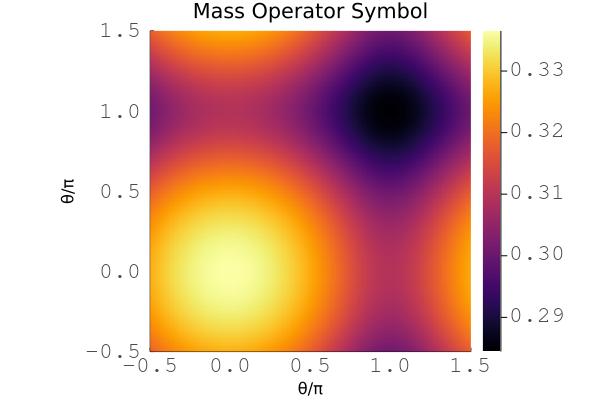
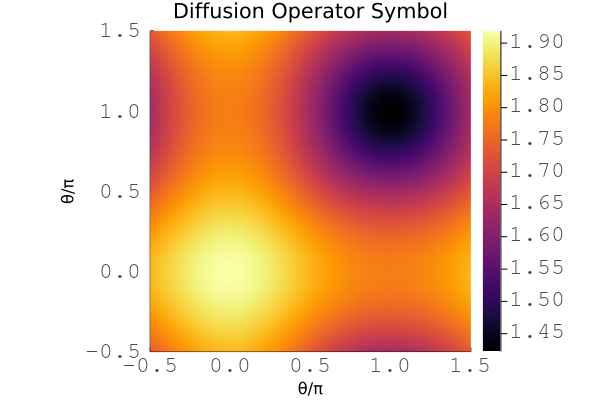

## Finite Element Operator

The finite element operator object provides the action of the user provide weak form on the given mesh and finite element bases.
This weak form follows the representation given in [2].

### Examples

This is an example of a scalar mass operator in two dimensions.

````@eval
using Markdown
Markdown.parse("""
```julia
$(read("../../../examples/ex001_mass.jl", String))
```
""")
````


Plot for the symbol of the finite element operator for the 2D scalar mass problem with cubic basis.

This is an example of a scalar diffusion operator in two dimensions.

````@eval
using Markdown
Markdown.parse("""
```julia
$(read("../../../examples/ex002_diffusion.jl", String))
```
""")
````


Plot for the symbol of the finite element operator for the 2D scalar diffusion problem with cubic basis.

### Documentation

The finite element operator can be defined from a user defined weak form or from the gallery of weak forms for select PDEs.

```@docs
Operator
computesymbols(::Operator, ::Array)
```
